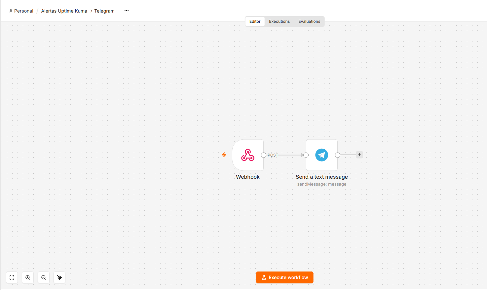
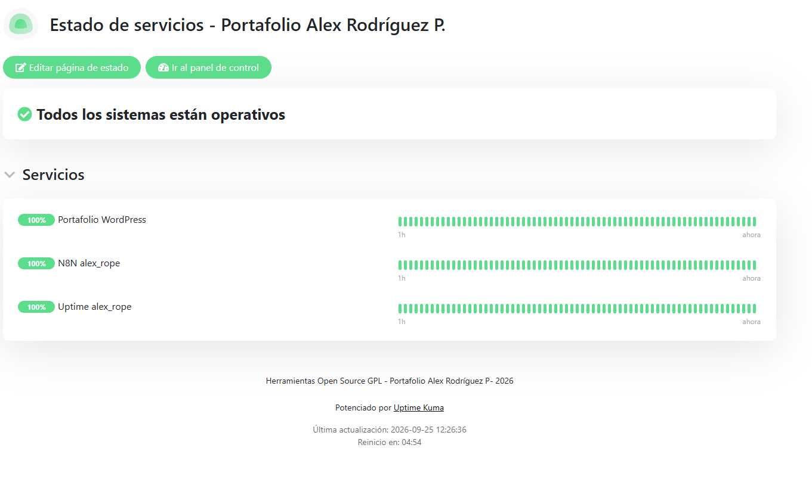
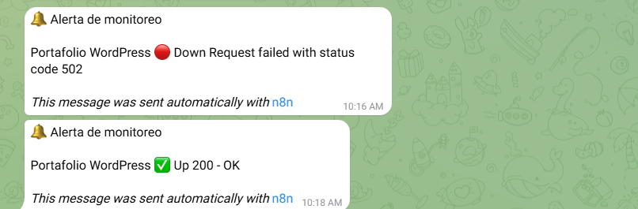

# Monitoreo de infraestructura con n8n + Uptime Kuma + Telegram

Sistema de alertas en tiempo real para servicios web autoalojados. Cuando un
servicio cae (o se recupera), llega un mensaje a Telegram en segundos, sin
tener que entrar a revisar paneles manualmente ni enterarse de la caída por un
usuario.

## Arquitectura

```
Uptime Kuma ──(webhook POST)──▶ n8n ──(Bot API)──▶ Telegram
```

1. **Uptime Kuma** monitorea 3 endpoints de forma continua: el portafolio en
   WordPress, la instancia de n8n y el propio Uptime Kuma.
2. Cuando un monitor cambia de estado (Up → Down o Down → Up), Uptime Kuma
   dispara una notificación de tipo **webhook** con un `POST` hacia n8n.
3. **n8n** recibe el payload en un nodo *Webhook*, toma el campo `msg` que
   envía Uptime Kuma y lo formatea con un encabezado (`🔔 Alerta de monitoreo`).
4. El nodo **Telegram** envía el mensaje final al chat configurado a través de
   la Telegram Bot API.



## En vivo

La página pública de estado está disponible en
**<https://status.alexrope.dev/status/portfolio-alex>**.



## Alertas reales



Estas capturas corresponden a una prueba real, no a una simulación: se detuvo
a propósito el contenedor de WordPress para provocar una caída verdadera.
Uptime Kuma detectó el error (`502` devuelto por el reverse proxy) y se recibió
la alerta de **Down**; al volver a levantar el contenedor, llegó la alerta de
**Up** con `200 - OK` unos minutos después.

## Cómo replicarlo

1. En n8n, importa el archivo [`workflow.json`](workflow.json)
   (*Workflows → Import from File*). Se importa directo, sin cambios previos.
2. Crea una credencial **Telegram Bot API** propia con el token de tu bot
   (obtenido con [@BotFather](https://t.me/BotFather)) y asígnala al nodo de
   Telegram.
3. Reemplaza los placeholders por tus valores reales:
   - `TU_WEBHOOK_PATH_AQUI` → la ruta del webhook (nodo *Webhook*).
   - `TU_CHAT_ID_AQUI` → el ID del chat o grupo de Telegram donde quieres
     recibir las alertas (nodo *Telegram*).
4. Activa el workflow y copia la **Production URL** del nodo Webhook.
5. En Uptime Kuma, crea una notificación de tipo **Webhook** apuntando a esa
   URL (método `POST`, cuerpo JSON) y asóciala a los monitores que quieras
   vigilar.

## Stack

- **Docker**: todos los servicios corren en contenedores.
- **n8n**: orquestación del flujo de alertas.
- **Uptime Kuma**: monitoreo de endpoints y página pública de estado.
- **Telegram Bot API**: canal de notificación.
- **Nginx**: reverse proxy con certificados TLS de **Let's Encrypt**.
- **Oracle Cloud (Always Free)**: VM donde se aloja toda la infraestructura.

## Licencia

[MIT](LICENSE) © 2026 Alex Rodríguez

---

> **Nota:** este es un proyecto de demostración construido sobre
> infraestructura propia (Oracle Cloud Always Free). No usa datos ni sistemas
> de ningún empleador anterior.
